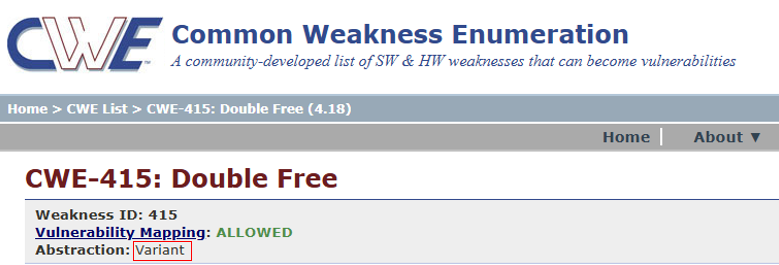

The data was originally collected from [BigVul Dataset](https://github.com/ZeoVan/MSR_20_Code_vulnerability_CSV_Dataset).

The following X specific columns are used in our experiments:
- **"func_before**: original vulnerable functions
- **"CWE ID"**: CWE-ID labels
- **"cwe_abstract_group"**: CWE abstract types 

The CWE abstract types are defined by the CWE community. For example, CWE-415 belongs to the “Variant” abstract type, as illustrated in the figure below.



You can download the processed dataset here for a quick start:

```
https://drive.google.com/file/d/1Q7KyVn1IcHAcWzvLfN2XX6WU--T-G75D/view?usp=drive_link
```